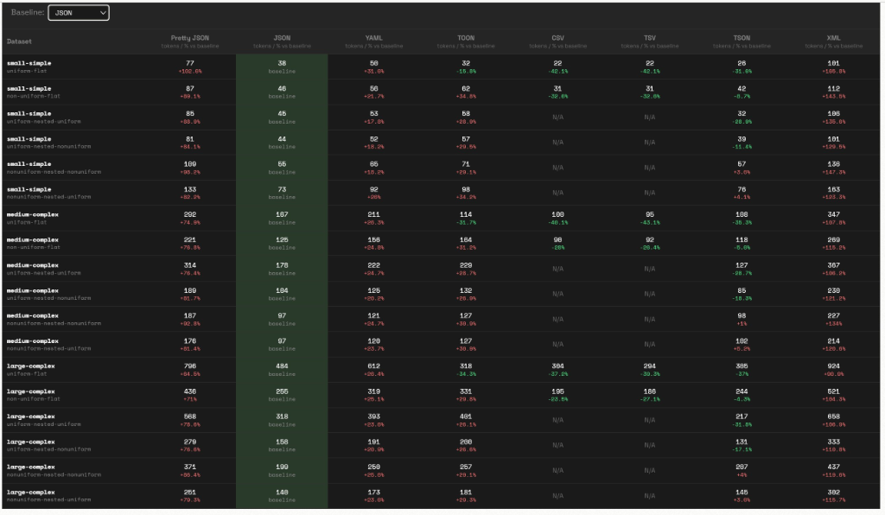

# TSON

**Token-efficient Structured Object Notation**

A compact, delimiter-based serialization format designed for efficient data exchange with Large Language Models.

[](https://opensource.org/licenses/MIT)
[](https://www.python.org/downloads/)
[](https://pypi.org/project/tson/)
[](https://www.npmjs.com/package/@zenoaihq/tson)

---

## Why TSON?

When working with Large Language Models, every token counts. JSON's verbose syntax—with repeated keys, excessive punctuation, and mandatory quotes—wastes tokens on formatting rather than meaningful data.

**TSON solves this through:**
- 🎯 **Schema Declarations** - Write keys once, not for every object
- 🔄 **Nested Schema Notation** - Declare nested object structures upfront
- ⚡ **Single Syntax** - One consistent format for all data types
- 🤖 **LLM-Friendly** - Delimiter-based structure that models can reliably parse and generate
- 🔒 **Lossless** - Perfect round-trip conversion to/from JSON

### Input vs Output Token Savings

TSON provides token savings in two ways:

**📥 Input Tokens (Sending data to LLM):**
- **25-65% reduction** in prompt size when sending structured data
- Fits more data in context windows
- Lower API costs for input tokens
- For shorter json input, savings will be negative as including prompt to explain tson will take more tokens than actual token save in json vs tson

**📤 Output Tokens (LLM generating data):**
- **30-70% reduction** in generated tokens for structured outputs
- LLMs generate shorter, more efficient responses
- Significant cost savings on output tokens (typically 2-10x more expensive than input)
- Faster generation due to fewer tokens to produce
- Results are much more consistent and error free as compared to other formats.

> **Note:** Comprehensive benchmarks across different LLM providers and data types coming soon!

## Quick Example

**JSON:**
```json
[
  {"id": 1, "name": "Alice", "email": "alice@example.com"},
  {"id": 2, "name": "Bob", "email": "bob@example.com"},
  {"id": 3, "name": "Carol", "email": "carol@example.com"}
]
```

**TSON:**
```
{@id,name,email#3|1,Alice,alice@example.com|2,Bob,bob@example.com|3,Carol,carol@example.com}
```

Field names (`id`, `name`, `email`) written **once** instead of repeated for each object.

## Implementations

### Python
[](python/)

```bash
cd python
pip install -e .
```

```python
import tson

data = [{"id": 1, "name": "Alice"}, {"id": 2, "name": "Bob"}]
encoded = tson.dumps(data)  # {@id,name#2|1,Alice|2,Bob}
decoded = tson.loads(encoded)  # Perfect round-trip
```

**[→ Python Documentation](python/README.md)**

### JavaScript/TypeScript
[](javascript/)
[](https://www.npmjs.com/package/@zenoaihq/tson)

```bash
npm install @zenoaihq/tson
```

```typescript
import { dumps, loads } from '@zenoaihq/tson';

const data = [{ id: 1, name: "Alice" }, { id: 2, name: "Bob" }];
const encoded = dumps(data); // {@id,name#2|1,Alice|2,Bob}
const decoded = loads(encoded); // Perfect round-trip
```

**[→ JavaScript Documentation](javascript/README.md)**

## Repository Structure

```
tson/
├── README.md              # This file
├── SPEC.md                # Format specification (language-agnostic)
├── prompts.md             # LLM prompt templates
├── LICENSE                # MIT License
├── CONTRIBUTING.md        # Contribution guidelines
│
├── python/                # Python implementation
│   ├── README.md          # Python-specific docs
│   ├── tson/              # Python package
│   ├── tests/             # Python tests (13 tests, all passing)
│   ├── examples/          # Python examples
│   └── setup.py           # PyPI package setup
│
├── javascript/        # JavaScript/TypeScript implementation
│   ├── README.md      # JavaScript-specific docs
│   ├── src/           # Source code
│   ├── test/          # Tests (14 tests, all passing)
│   └── package.json   # NPM package config
│
└── benchmarks/            # Cross-language benchmarks (future)
    └── ...
```

## Core Features

### 1. Tabular Format
Array of objects with keys declared once:
```
{@key1,key2#N|val1,val2|val1,val2}
```

### 2. Nested Schema Notation
Nested objects with schema in header:
```
{@id,address(@city,zip)#2|1,{NYC,10001}|2,{LA,90001}}
```

### 3. Universal Coverage
Handles all JSON types: objects, arrays, strings, numbers, booleans, null.

### 4. Type Preservation
Correctly distinguishes strings from numbers:
```
{@zip_string,zip_number|"10001",10001}
```

## Use Cases

- **LLM Function Calling** - Reduce token costs for function arguments (30-50% savings)
- **Context Windows** - Fit more data in limited context
- **Structured Output** - Easier for LLMs to generate valid data
- **Data Storage** - More compact file sizes

## Documentation

- **[SPEC.md](SPEC.md)** - Complete format specification
- **[prompts.md](prompts.md)** - LLM integration guide and prompt templates
- **[CONTRIBUTING.md](CONTRIBUTING.md)** - How to contribute

### Language-Specific Docs
### Language-Specific Docs
- **[Python Documentation](python/README.md)** - Installation, API reference, examples
- **[JavaScript Documentation](javascript/README.md)** - Installation, API reference, examples

## Playground

Explore TSON tokenization and verify compatibility with **[interactive playground](https://www.curiouslychase.com/playground/format-tokenization-exploration?mode=preset&size=small-simple&structure=uniform-flat)**. This tool helps visualize token savings and structure across different formats.



## Comparison with Alternatives

| Format | Universal | Token Savings | LLM Generation | Nested Schema |
|--------|-----------|---------------|----------------|---------------|
| JSON | ✅ | 0% | ✅ Easy | ✅ **Yes** |
| CSV | ❌ Tabular only | 60-70% | ✅ Easy | ❌ |
| **TSON** | ✅ | **30-70%** | ✅ **Delimiter-based** | ✅ **Yes** |

**Key advantages:**
- ✅ Delimiter-based (more reliable than indentation for LLM generation)
- ✅ Nested schema notation
- ✅ Universal (handles all JSON types)
- ✅ Single consistent syntax

## Design Principles

1. **Token Efficiency** - Minimize redundancy through schema declarations
2. **Single Syntax** - One format for all data types
3. **Delimiter-Based** - Explicit separators, not whitespace-dependent
4. **LLM-Friendly** - Clear structure that models can parse and generate
5. **Universal** - Complete JSON compatibility

## Contributing

We welcome contributions! Whether you're:
- Implementing TSON in a new language
- Improving existing implementations
- Adding documentation or examples
- Reporting bugs or requesting features

Please see [CONTRIBUTING.md](CONTRIBUTING.md) for guidelines.

## License

MIT License - see [LICENSE](LICENSE) file for details.

Copyright (c) 2025 Zeno AI

## Acknowledgments

- Inspired by other object notations like **JSON**, **TOON**, **TOML**, etc.
- Design concepts from **CSV**, **MessagePack**, and **Protocol Buffers**
- Built for the LLM community

---

**Version:** 1.0.1
**Status:** Production Ready (Python & JavaScript)

*Built for efficiency. Optimized for LLMs.*
Developed by Zeno AI (https://zenoai.tech)
Please reach out to shubham@zenoai.tech for any queries
